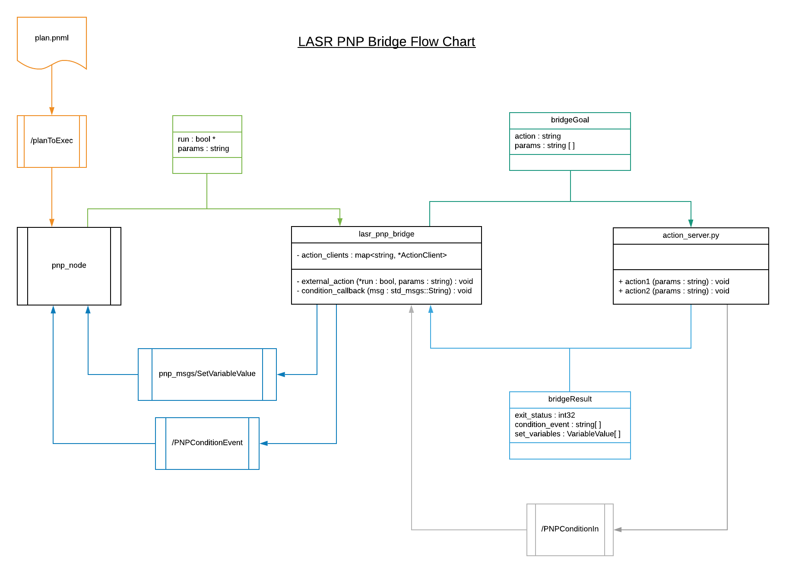

# Requirements

* PNP Node and JARP, available at https://github.com/iocchi/PetriNetPlans/tree/master/PNP
* Actionlib; Action Clients and Servers

# Setup

Plans
 * Plans can be created using JARP (link above)
 * PNP can be viewed as a series of actions in a flowchart
 * The flowchart is parsed by the PNP node to call actions implemented in C++

Places (PNP)
 * LASR created a generic action that will send actionNames and params to any Action Server
 * This allows external Servers written in Python and C++ to provide implementations
 * Commands will be parsed and send a goal of strings - action, params[] - to a specified topic
 * Syntax for PNP place: 'extern\_topicName/ActionName\_param1\_param2\_...'

Actions (Python and C++)
 * Actions can be implemented in Python using Actionlib Simple Action Servers
 * Callbacks will receive data in the form of a goal of strings - action, params[] -
 * Implementation of actions using this information is then up to the developer
 * In the example, we use getattr() to call a method of name action

# Run plans using LASR PNP Bridge

Terminals required:
1. Roscore
2. PNP node
3. LASR PNP bridge
4. Action implementations (in the form of action servers)

I recommend creating a launch file to run the PNP node, LASR PNP bridge and
action servers simultaneously, where a "plans folder" can be specified under
PNP node.

To run a plan, publish the plan name (- .pnml) of a plan located in the plans folder
to the ROS topic /planToExec.

Any places in the PNP of the form 'extern\_topicName/actionName\_param1\_param2\_...'
will be parsed by the LASR PNP Bridge, where the actionName and params will be sent
as a goal to an Action Server at topicName.

An example can be found here: https://gitlab.com/sensible-robots/lasr_pnp_example

# Flowchart

